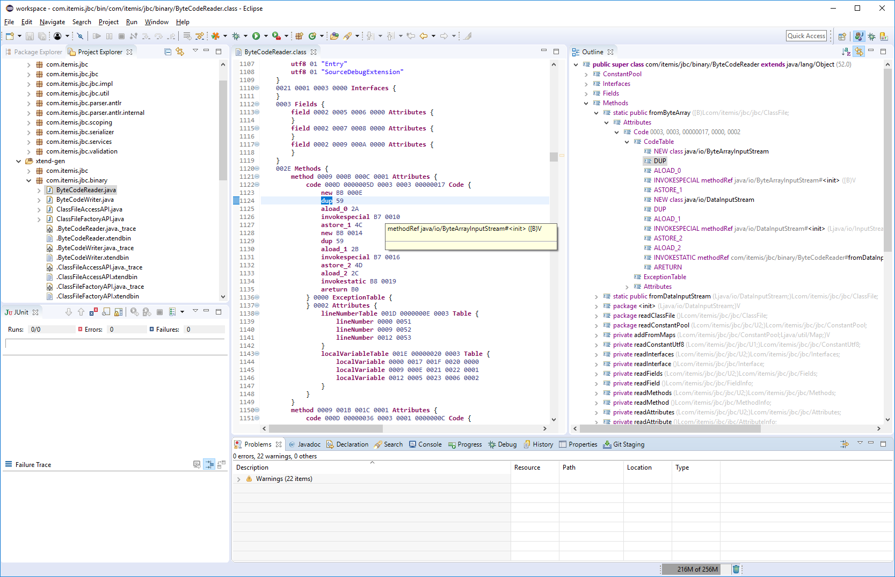
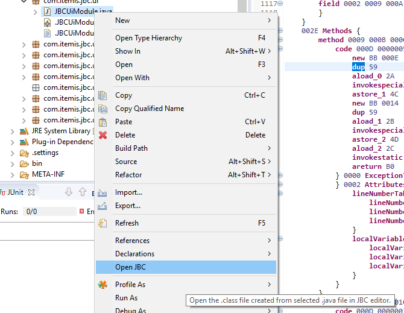
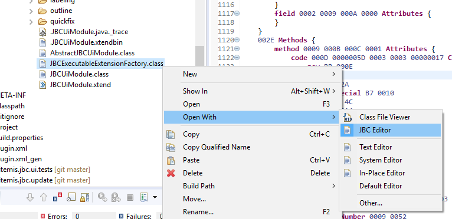

# JBC

JBC is an eclipse plugin that enables the developer to view and edit files containing java byte code (*.class) inside eclipse.
This is done in a way such that a specialized editor opens the .class file and displays the binary code as a textual DSL whereas keywords intersparse the byte sequences.
Changing the text and saving then writes back the bytes to the .class file.

## Installation

To install the editor you have to add the following update site to eclipse:

http://download.itemis.com/jbc/updates/

You can do so by going through the main menu under "Help->Install New Software...", click an "Add..." and insert the URL in the dialog. You can then install the feature "JBC / JBC Feature".

There is also an entry in the eclipse marketplace:

http://marketplace.eclipse.org/content/jbc/

## Usage

When first time opening Editor within a project, a dialogue will appear with suggestion to convert to Xtext project.  
Saying "No" is perfectly ok, the editor does not require the nature.  
Probably in a future Xtext version one can introduce a method in the XtextEditor to opt-out from the dialog.
[#6](https://github.com/itemis/jbc/issues/6)

To support the developer the outline displays and interpretation of the byte code with resolved references.
There is validation and quick fixes for table sizes as well as quick navigation (F3) to referenced elements, autocompletion, hover information and some more.

One can open the .class file for a java file from the Project or Package Explorer by executing the context menu action "Open JBC". The opened class file can be viewed and editor. But of course, if you modify your java file, the class file will be overridden. This is mostly intended to help you understand what your source code is transformed to by the compiler.

It is also possible to open a .class file directly from the Project or Package Explorer by opening it with the "JBC Editor". It is not necessary that the class file is inside a java project, it just needs to be in the workspace. You can, for example, extract some jar, modify the included .class files and write them back to the jar. This way you can modify existing jars without having the source available.

## External Links

- Introductional article: [4+1 = CAFEBABE: Java Bytecode in Eclipse](https://blogs.itemis.com/de/41-cafebabe-java-bytecode-in-eclipse) (german)
- Some technical background: [Xtext-Editor für binäre Dateien](https://blogs.itemis.com/de/xtext-editor-fuer-binaere-dateien) (german)

